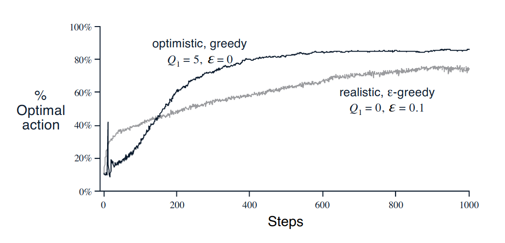
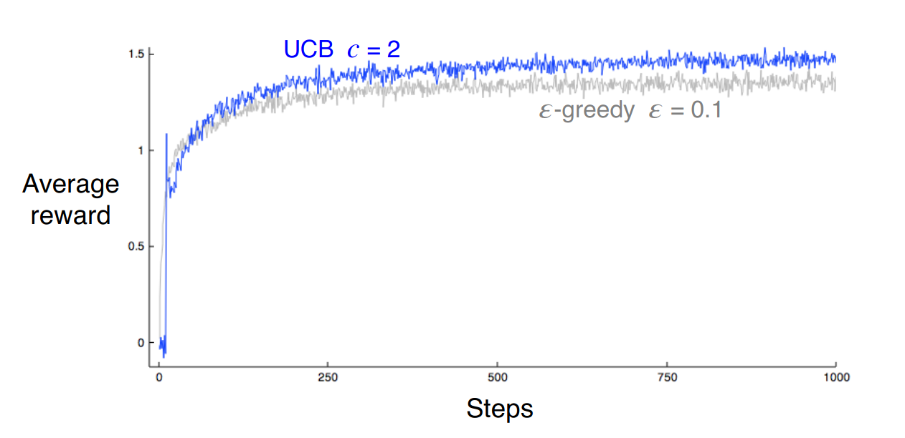
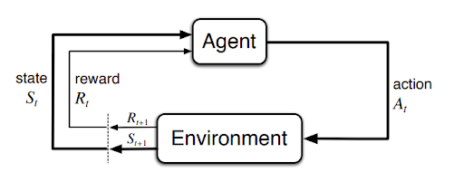

# Reinforcement Learning - Tabular Solution Methods

## Index
- [Multi-arm Bandits](#multi-arm-bandits)
- [Finite Markov Decision Processes](#finite-markov-decision-processes)
- [Dynamic Programming](#dynamic-programming)
- [Monte Carlo Methods](#monte-carlo-methods)
- [Temporal-Difference Learning](#temporal-difference-learning)
- [Eligibility Traces](#eligibility-traces)
- [Planning and Learning with Tabular Methods](#planning-and-learning-with-tabular-methods)
- [References](#references)

## Multi-arm Bandits

Importantly, RL uses training information that _evaluates_ the actions taken rather than _instructs_ by giving correct actions. This is what creates the need for active exploration, for an explicit trial-and-error search for good behavior.

|Comparison | Evaluative Feedback | Instructive Feedback |
|---|---|---|
|Relationship with the action taken | Depends entirely on it | Independently of it |
| Usage | The basis of methods for function optimization, including evolutionary methods | The basis of supervised learning, as pattern classification, artificial neural networks and system identification|

Simpliestly, we use the _nonassociate_ setting does not involve learning to act in more than one situation, in which most prior work involving evaluative feedback has been done, and it avoid much of the complexity of the full RL problem. Studying this case will enable us to see most clearly how evaluatiive feedback differs from, and yet can be combined with, instructive feedback.

### An n-Armed bandit

You are faced repeatedly with a choice among *n* different actions. After each choice you receive a numerical reward chosen from a stationary probability distribution that depends on the action you selected. Your objective is to maximize the expected total reward over some time playing.

Each action has an expected or mean reward given that action is selected, called is _value_ of that action. Assumming that you do not know the action values with certainty , although you may have estimates.
| | Greedy action | Nongreedy action|
|---|---|---|
|Way to estimates of the action values | At any time step always choose one action has greatest estimated value | Choose another action|
|Strategy style | Exploiting | Exploring|
|Reward | Only higher in the short run | Can higher in the long run |

Any single action selection is imposible both to explore and to exloit, it ofter refers to to the conflict between exploration and exploitation. Therefore, we will care the simple ways to balance them.

### Action-Value Methods

We denote the true value of action *a* as *q(a)*, and the estimated value on _t_-th time step as *Qt(a)*.

The true value of an action is the mean reward received when that action is selected.

One naive way to estimate this is the _sample-average method_, by averaging the rewards received by _Nt(a)_ times prior to _t_ before the action was selected.
  
=\frac{R_1+R_2+...+R_{N_t(a)}}{N_t(a)})

If _Nt(a)_ = 0 , we define default value as _Q1(a)_ = 0.\
If _Nt(a)_ &#8594; &infin;, _Q_t(a) &#8594; _q(a)_ (by  the  law  of  large  numbers)

The simplest action selection rule is to select the action with highest estimated action value, to select at step _t_ one of the greedy action, A\*t, for which Qt(A\*t) = maxa Qt(a). This _greedy_ action selection method can be written as

)

A simple alternative is to behave greedily most of the time, but every once in a while, with small probability &epsilon;, instead to select randomly from amongst all the actions with equal probability independently of the action-value estimates. The calling are _&epsilon;-greedy_ methods.

### Incremental Implementation
The estimate of the value of action _a_ is not really necessary to compute it again. Easily solving it out with incremental update formulas for computing averages with small, constant computation required to process each new reward. For some action, let _Qk_ denote the estimate for its _k_-th reward, that is, the average of its first _k - 1_ rewards.

) 

The update rule is 

)

In processing the _k_-th reward for action _a_, that method uses a step-size parameter of 1&frasl;k. We denote it by the symbol _&alpha;_ or, more generally, by _&alpha;t(a)_.

) 

### Tracking a Nonstationary Problem
The step-size parameter _&alpha;_ &in; (0, 1]1 is constant. The results in _Qk+1_ being a weighted average of past rewards and the initial estimate _Q1_:

=(1-\alpha)^kQ_1+\sum_{i=1}^k\alpha(1-\alpha)^{k-i}R_i)

We call this a weighted average because the sum of the weights is ^k+\sum_{i=1}^k\alpha(1-\alpha)^{k-i}=1). The weight decays exponentially according to the exponent on 1 - &alpha;, this is sometimes called an _exponential_, _recency-weighted average_.

Sometimes it is convenient to vary the step-size parameter from step to step. Let _&alpha;k(a)_ denote the step-size parameter used to process the reward received after the _k_-th selection of action _a_. The choice _&alpha;k(a) = 1&frasl;k_ results in the sample-average method, which is guaranteed to converge to the true action values by the law of large numbers. But of course convergence is not guaranteed for all choices of the sequence _{&alpha;k(a)}_. Although these parameters meet the conditions often converge very slowly or need considerable tuning in order to obtain a satisfactory convergence rate. Therefore, they are often used in theoretical work, which are seldom used in applications and empirical research.

### Optimistic Initial Values
All the above methods are dependent to some extent on the initial action-value estimates, _Q1(a)_. Statistically, these methods are _biased_ by their initial estimates.

In pratice, this kind of bias is usually not a problem, and can sometimes be very helpful. The downside is that the initial estimates become, in effect, a set of paremeters that must be picked by the user, if only to set them all to zero. The upside is that they provide an easy way to supply some prior knowledge about what level of rewards can be expected.

This optimism encourages action-value methods to explore. Initially, the optimistic method performs worse because it explores more, but eventually it performs better because its exploration decreases with time.

### Upper-Confidence-Bound Action Selection

Exploration is needed because the estimates of the action values are uncertain. The greedy actions are those that look best at present, but some of the other actions may really be better. &epsilon;-greedy action selection forces the non-greedy actions to be tried indiscriminately, with no preference for those that are nearly greedy or particularly uncertain. One effective way of doing this is to select actions as

+c\sqrt{\frac{lnt}{N_t(a)}}\Bigg])

where ln _t_ denotes the natural logarithm of _t_, and the number _c_ > 0 controls the degree of exploration. If _Nt(a)_ = 0, then _a_ is considered to be a maximizing action.

The idea of this _upper confidence bound_ (_UCB_) action selection is that the square-root term is a measure of the uncertainty or variance in the estimate of _a_'s value. Each time _a_ is selected the uncertainty is presumably reduced; _Nt(a)_ is incremented and, the term is descreased. Each time an action other _a_ is selected _t_ is increased, this term is increased too. The use of the natural logarithm means that the increase gets smaller over time, but is  unbounded; all actions will eventually be selected, but as time goes by it will be a longer wait.

In these more advanced settings there is currently no known practicalway of utilizing the idea of UCB action selection.

### Gradient Bandits
We consider learning a numerical _preference_ Ht(a) for each action _a_. The larger the preference, the more often that action is taken, but it has no interpretation in terms of reward.

}}{\sum_{b=1}^ne^{H_t(b)}}=\pi_t(a))

The probability of taking action _a_ at time _t_, which are determined according to a soft-max distribution. Initially, all preferences are the same so that all actions have an equal probability of being selected.

There is a natural learning algorithm for this setting based on the idea of stochastic gradient ascent. On each step, after selecting the action _At_ and receiving the reward _Rt_, them are updated by:

=H_t(A_t)+\alpha(R_t-\bar{R}_t)(1-\pi_t(A_t))), and\
=H_t(a)-\alpha(R_t-\bar{R}_t)\pi_t(a),{\forall}a{\neq}A_t)

where _&alpha;_ > 0 is a step-size parameter, and t &in; &reals; is the average of all the rewards up through and including time _t_, which can be computed incrementally above. The t term serves as a baseline with which the reward is compared. If the reward is higher than the baselin, then the probability of taking _At_ in the future is increased, and else below then probability is decreased. The non-selected actions move in the opposite direction.

One can gain a deeper insight into this algorithm by understanding it as a stochastic approximation to gradient ascent. Exactly, each preference _Ht(a)_ would be incrementing proportional to the increment's effect on performance:

=H_t(a)-\alpha\frac{\partial\mathbb{E}\\[R_t\\]}{{\partial}H_t(a))

where the measure of performance here is the expected reward: 

q(b))

Of course, it is impossible to implement gradient ascent exactly because by assumption we do not know the _q(b)_, but in fact the updates of the algorithm equally in expected value, making the algorithm an instance of stochastic gradient ascent.

### Associative Search
So far we have considered only nonassociative tasks, in which there is no need to associate different actions with different situations. However, in a general reinforcement learning task there is more than one situation, and the goal is to learn a policy: a mapping from situations to the actions that are best in those situations. To set the stage for the full problem, the simplest way in which nonassociative tasks extend to the associative setting.

### Summary

The simple ways of balanceing exploration and exploitation.
- The &epsilon;-greedy methods choose randomly a small fraction of the time.
- UCB methods choose deterministically, achieve explorationq by subtly favoring at each step the actions that have so far received fewer samples.
- Gradient-bandit algorithms estimate not action values, but action preferences, and favor the more preferred actions in a graded, probabilistic manner using a soft-max distribution.
- The simple expedient of initializing estimates optimistically causes even greedy methods to explore significantly.

Despite their simplicity can fairly be considered the state of the art. There are more sophisticated methods, but their complexity and assumptions make them impractical for the full RL problem that is our real focus. However, these methods are far from a fully satisfactory solution to the problem of balancing exploration and exploitation.

## Finite Markov Decision Processes 

### The Agent-Environment Interface

The RL problem is meant to be a straightforward framing of the problem of learning from interaction to achieve a goal. 
- The learner and decision-maker is called the **agent**.
- The thing it iteracts with, comprising everything outside the agent, is called the **environment**.
- The agent selecting actions and the environment responding to those actions and presenting new situations to the agent.
- The environment gives rise to numerical rewards that the agent tries to maximize over time.

Specifically, the agent and environment interact at each of a sequence of discreate time steps, _t_ = 0, 1, 2, 3,...
- At each time step _t_,
  - The agent receives some representation of the environment's **state**, , where  is the set of possible states.
  - Basic selects an **action**, ), where ) is the set of actions avaible in state .
- One time step later,
  - The agent receives a numerical **reward**, .
  - Finds itself in a new state, .

At each time step, a mapping implemented from states to probabilities of selecting each possible action by the agent what is called the agent's **policy**. It is denoted _&pi;t_ where _&pi;t_(_a_|_s_) is the probability that _At_ = _a_ if _St_ = _s_. RL methods specify how the agent changes its policy as a result of experience to maximize the total amount of reward it receives over the long run.

The boundary between agent and environment is not often the same as the physical boundary of a robot's or animal's body. It is determined once one has selected particular states, actions, and rewards, and thus has identified a specific decision-making task of interset.

The RL framework is a considerable abstraction of the problem of goal-directed learning from interaction. It proposes that whatever the details of the sensory, memory and control apparatus, and whatever objective one is trying to achieve, any problem of learning goal-directed behavior can be reduced to three signals passing back and forth between an agent and its environment:
- One signal a.k.a an action to represent the choices made by the agent.
- One signal a.k.a an state to represent the basis on which the choices are made.
- One signal a.k.a an reward to define the agent's goal.

### Goals and Rewards

At each time step, the **reward** is a simple number, . The agent's **goal** is to maximize the total amount of reward it receives by cumulate reward in the long run, do not immediate reward.

### Returns

The (expected) **return** is the sum of the rewards that received after time step _t_ is denoted _Rt+1, Rt+2, Rt+3,..._:

where  is a final time step.
- From starting to when the agent-environment interaction breaks naturally into subsequences, it is **episodes**.
- Each episode ends in a special state is **terminal state**.
- Tasks with episodes of this kind are called **episodic tasks**. In episodic tasks sometimes need to distinguish the set of all nonterminal states as , from the set of all states plus the terminal state as 

In many cases the agent-enviromnment interaction does not break naturally into identifiable episodes, it goes on continually without limit. We call these **continuing tasks**.The final time step would be _T_ = &infin;, and the return, which is problematicly what we are trying to maximize, could itself easily be infinite. 

The agent tries to select actions so that the sum of the discounted rewards it receives over the future is maximized. In particular, it chooses _At_ to maximize the expected **discounting return**:

where &gamma; is a parameter, 0 &le; &gamma; &le; 1, called the **discount rate**.

The discount rate determines the present value of future rewards.
- If &gamma; < 1, the infinite sum has a finite value as long as the reward sequence {_R_k} is bounded.
- If &gamma; = 0, the agent is myopic in being concerned only with maximizing immediate rewards.
- If &gamma approachs 1, the objective takes future rewards into account more strongly, the agent becomes more farsighted.

### The Markov Property

The markov property is a property of environments and their state signals that is of particular interest. We treat the state as information is available to the agent. It is importantly given by some preprocessing system, but we focus fully on the decision-making issues rather than onstructing, changing, or learning the state signal. 

The state signal should be not be expected to inform the agent of everything about environment, or even everything that would be useful to it in making decisions.
Ideadlly, is a state signal that summarizes past sensations compactly, yet in such a way that all relevant information is retained. A state signal that succeeds in retaining all relevant information is said to be **Markov**.

Formally define the Markov property for the RL problem with a assumely finite number of states and reward values. Consider how a general environment might respond at time _t_ + 1 to the action taken at time _t_. In the most general, causal case this response may depend on everything that has happended earlier. In this case the dynamics can be defined only by specifying the complete probability distribution:

for all _r_, _s'_, and all possible values of the past events: _S0, A0, R1, ..., St-1, At-1, Rt, St, At_. If the state signal has the **Markov property**, on the other hand, then the environment's respone at _t_ + 1 depends only on the state and action represetations at _t_, in which case the environment's dynamics can be defined by specifying only

=Pr\\{R_{t+1}=r,S_{t+1}=s'|S_t,A_t\\})

for all _r_, _s'_, _S_t, _A_t.

If an environment has the Markov property, then its one-step dynamics enable us to predict the next state and expected next reward given the current state and action. Even when the state signal is non-Markov it is still appropriate to think of the state in RL as an approximation to a Markov state.

### Markov Decision Processes

A RL task that satisfies the Markov property is called a **Markov decision process**, or MDP. If the state and action spaces are finite then it is called a **finite MDP** that are particularly important to the theory of RL.

A particular finite MDP is defined by its state and action sets and by the one-step dynamics of the environment. Given any state _s_ and action _a_, the probability of each possible pair of the next state and reward, _s'_, _r_, is denoted

=Pr\\{S_{t+1}=s',R_{t+1}=r|S_t=s,A_t=a\\})
## Dynamic Programming

## Monte Carlo Methods

## Temporal-Difference Learning

## Eligibility Traces

## Planning and Learning with Tabular Methods

## References
