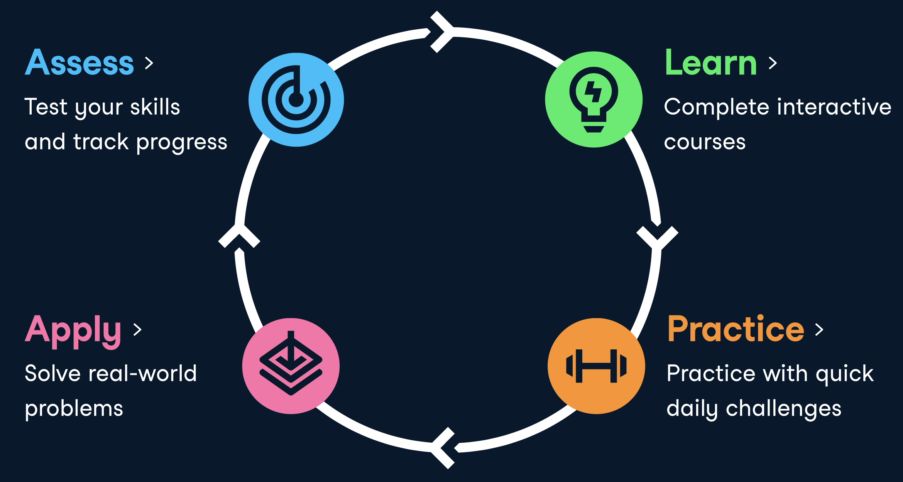

# Willow Seedling
Willower's Seedling stage.
Training hub for Willogy new team members. Learn by doing and sharing.

## Introduction
Willow Seedling is not only a training hub for our new team members to quickly warm up and study for growing, but also a place to share and discuss new technologies, espcially with a strong focus in Deep Tech and AI (Artificial Intelligence).

## Perspective
The world is growing fast with rapid advances in new technologies which enable more possibilities for innovation. At Willogy, we make Deep Tech dream a reality. Deep Tech can be seen through the lens of Industry 4.0, in which technologies are widely innovating and conducted, including but not limited to physical (autonomous vehicles, new materials, 3D printing, advanced robotics) or biological (genetic engineering, neuro-technology, bio-printing) applications.

## Topic Submission
When you're done with your study and assessment, please submit an [RFC](https://en.wikipedia.org/wiki/Request_for_Comments), a well-known collaboration practice among the programmers, following this [topic template](_template_topic.md) or use these as references:

- https://github.com/apple/swift-evolution/tree/master/proposals
- https://github.com/golang/proposal/tree/master/design

Your directory should follow this structure:

```
topic
│   README.md
└───src/
│       README.md
│       main.py
└───images/
└───docs/
└───demos/
└───dataset/
```

## Contributing
We love pull requests. If you have something you want to add or revise, please open a new pull request. Please leave all PRs open for at least a week to get feedback from everyone.



## License
Creative Commons Attribution 4.0 International (CC BY 4.0) @ [Willogy](https://willogy.io)
